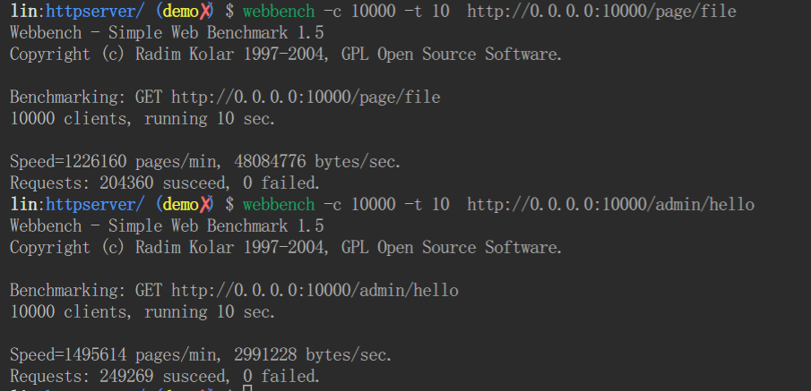

@[TOC]
# 基于 Linux 的高性能 web 服务器

## 功能
> 1. 基于 epoll + proactor 构建的高并发模型
> 2. 利用线程池来管理工作线程，封装了一个数据库连接池来管理数据库连接
> 3. 利用小根堆实现的定时器，关闭超时连接
> 4. 利用字典树来进行url的路由匹配
> 5. 利用RAll机制来管理资源
> 6. 异步日志系统，用来记录服务器情况
> 7. 自动扩容的Buffer
> 8. 解析HTTP报文 实现了cookie 和 url参数的解析
> 9. 内置 json 解析器，实现了json格式数据的解析

## 环境
> Linux 2.6.28 以上、C++ 14以上、MySql

## 压力测试


测试均在局域网下完成、且关闭日志系统
> 1. 测试获取小文件  
测试命令: ```webbench -c 10000 -t 10  http://0.0.0.0:10000/page/file```
测试结果: 20436 QPS                 
> 2. 测试访问网页  
测试命令: ```webbench -c 10000 -t 10  http://0.0.0.0:10000/admin/hello```   
测试结果：24926 QPS

通过多次测试，在一万并发的连接下，在单次访问数据量不大时，比如接口服务，传输json这种样子的数据，且是简单任务时。QPS可以达到两万以上。
## JSON 部分
> 分为JSON解释器和JSON生成器
> 效果如下:
### 结构部分
需要用户手动自定义load函数

```c++
struct person {
  std::string name;
  std::string detail;
  int age;
  void load(const lins::Json& json) {
    name = json["name"].STRING();
    detail = json["detail"].STRING();
    age = json["age"].NUMBER();
  }
  BEGIN_DUMP_JSON
  MAPPING(name, "name");
  MAPPING(detail, "detail");
  MAPPING(age, "age");
  END_DUMP_JSON
};
struct student {
  int stuNo;    // 学号
  int classNo;  // 班级
  person info;
  void load(const lins::Json& json) {
    stuNo = json["stuNo"].NUMBER();
    classNo = json["classNo"].NUMBER();
    info.load(json["info"]);
  }
  BEGIN_DUMP_JSON
  MAPPING(stuNo, "stuNo");
  MAPPING(classNo, "classNo");
  MAPPING(info, "info");
  END_DUMP_JSON
};

struct theacher {
  int studentNo;
  person info;
  void load(const lins::Json& json) {
    studentNo = json["studentNo"].NUMBER();
    info.load(json["info"]);
  }
  BEGIN_DUMP_JSON
  MAPPING(studentNo, "studentNo");
  MAPPING(info, "info");
  END_DUMP_JSON
};

struct classroom {
  std::vector<student> stu;
  std::vector<theacher> tch;
  void load(const lins::Json& json) {
    for (auto& v : json["stu"].LIST()) {
      auto t = student();
      t.load(v);
      stu.push_back(t);
    }
    for (auto& v : json["theacher"].LIST()) {
      auto t = theacher();
      t.load(v);
      tch.push_back(t);
    }
  }
  BEGIN_DUMP_JSON MAPPING(stu, "stu");
  MAPPING(tch, "tch");
  END_DUMP_JSON
};
```
### 生成Json
```c++

classroom room = \ 
{.stu{
      student{1001, 5, {"张三", "一个学生", 15}},
      student{1002, 5, {"李四", "一个学生", 16}},
      student{1003, 5, {"王五", "学生一个", 19}},
      student{1004, 5, {"坤坤", "唱跳rap篮球", 18}},
      student{1005, 5, {"老六", "一个学生", 19}},
      student{1006, 5, {"青霞", "一个学生", 19}},
  },
  .tch{
      theacher{10086, {"李老师", "语文", 45}},
      theacher{10087, {"张老师", "数学", 35}},
      theacher{10081, {"结衣老师", "老师", 25}},
  }};
auto res = room.dump();
auto str = res.toString(true);
std::cout << str << endl;
```

效果如下

``` json
"stu": [
{
  "classNo": 5,
  "info": {
    "age": 15,
    "detail": "一个学生",
    "name": "张三"
  },
  "stuNo": 1001
},
{
  "classNo": 5,
  "info": {
    "age": 16,
    "detail": "一个学生",
    "name": "李四"
  },
  "stuNo": 1002
},
{
  "classNo": 5,
  "info": {
    "age": 19,
    "detail": "学生一个",
    "name": "王五"
  },
  "stuNo": 1003
},
{
  "classNo": 5,
  "info": {
    "age": 18,
    "detail": "唱跳rap篮球",
    "name": "坤坤"
  },
  "stuNo": 1004
},
{
  "classNo": 5,
  "info": {
    "age": 19,
    "detail": "一个学生",
    "name": "老六"
  },
  "stuNo": 1005
},
{
  "classNo": 5,
  "info": {
    "age": 19,
    "detail": "一个学生",
    "name": "青霞"
  },
  "stuNo": 1006
}
]
```
### 解释器

```c++
auto jsonObject = lins::JsonParse(str).parse();
```


## 路由部分
支持了更加modern C++的写法  
可以这样写
```c++
server.addPage("/page/file",
                 [](lins::HttpRequest& req, lins::HttpResponse& res) -> bool {
                   res.setFileHandle("/home/lin/nets/httpserver/main.cpp");
                   return true;
                 });
```
也可以这样写
```c++
bool login(lins::HttpRequest& req, lins::HttpResponse& res) {
  if (!strcasecmp(req.method().c_str(), "get")) {
    res.setBody("not found this page");
    res.setStatusCode_(res.BadRequest400);
    return false;
  } 
    
  res.setBody(
        code{.code = "200", .msg = "hello"}.dump().toString());
  return true;
}
server.addPage("/api/user", login);
```